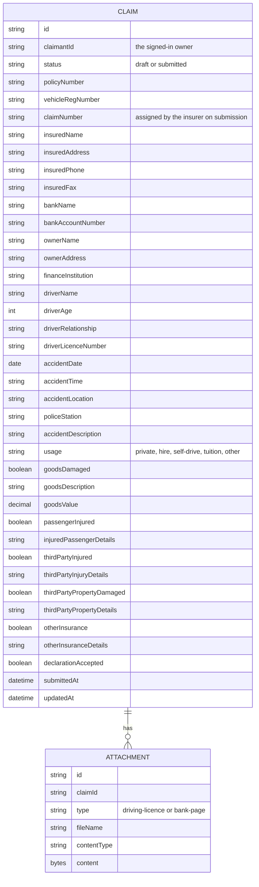

# Domain model

A claim belongs to the claimant who started it and moves from `draft` to
`submitted`; once submitted it is immutable. Its sections mirror the paper
motor claim form, and each attachment (a driving-licence copy, a certified
bank-page copy) belongs to one claim.

A claim's conditional sections (goods, injured passenger, third-party injury,
third-party property, other insurance) each carry their own yes/no flag; their
detail fields are only meaningful when that flag is true.