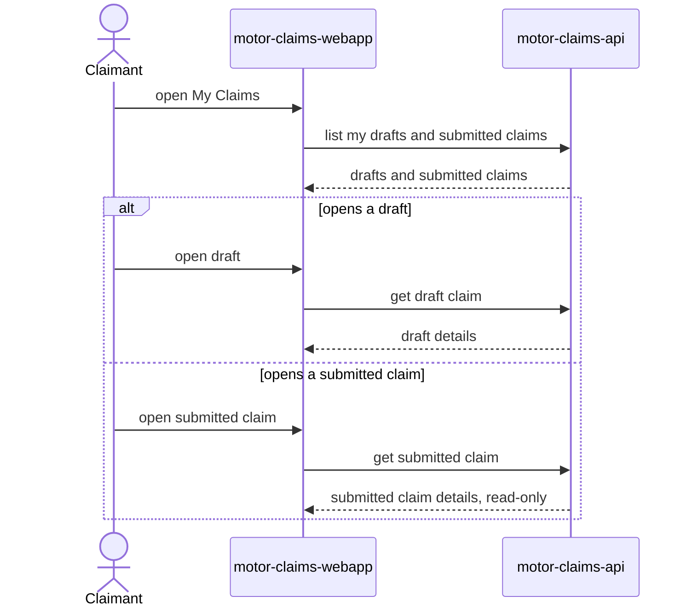

# Review claims on the dashboard

A claimant opens their dashboard to resume a draft or review a past
submission, read-only.

```mermaid
sequenceDiagram
    actor Claimant
    participant webapp as motor-claims-webapp
    participant api as motor-claims-api

    Claimant->>webapp: open My Claims
    webapp->>api: list my drafts and submitted claims
    api-->>webapp: drafts and submitted claims
    alt opens a draft
        Claimant->>webapp: open draft
        webapp->>api: get draft claim
        api-->>webapp: draft details
    else opens a submitted claim
        Claimant->>webapp: open submitted claim
        webapp->>api: get submitted claim
        api-->>webapp: submitted claim details, read-only
    end
```