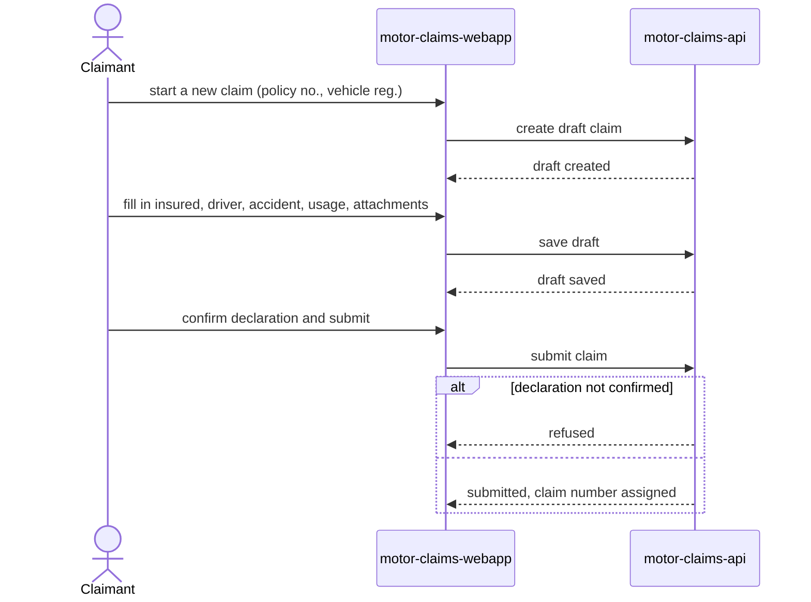

# Submit a motor claim

A claimant fills in the motor claim form section by section, saving it as a
draft at any point, and submits it once the declaration is confirmed.

```mermaid
sequenceDiagram
    actor Claimant
    participant webapp as motor-claims-webapp
    participant api as motor-claims-api

    Claimant->>webapp: start a new claim (policy no., vehicle reg.)
    webapp->>api: create draft claim
    api-->>webapp: draft created
    Claimant->>webapp: fill in insured, driver, accident, usage, attachments
    webapp->>api: save draft
    api-->>webapp: draft saved
    Claimant->>webapp: confirm declaration and submit
    webapp->>api: submit claim
    alt declaration not confirmed
        api-->>webapp: refused
    else
        api-->>webapp: submitted, claim number assigned
    end
```